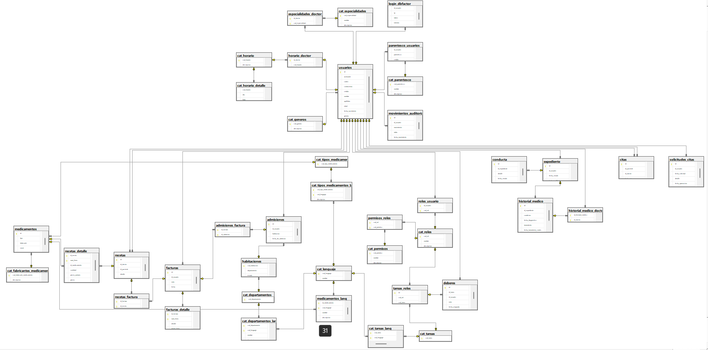

# Base de datos de gestión hospitalaria - Proyecto Base Datos I

La implementación de una base de datos de administración hospitalaria brinda varios beneficios, ya que recopila y almacena información sobre procedimientos médicos, pacientes, médicos, departamentos y suministros médicos, lo que facilita la gestión hospitalaria y mejora la calidad de la atención al paciente. Además, la gestión de la información de facturación y el soporte multilingüe también son importantes para mejorar la eficiencia y la precisión de los servicios de atención médica.

## Objetivo general  

El objetivo de implementar una base de datos de administración hospitalaria es que va a mejorar la eficiencia, la precisión y la seguridad del sistema de atención médica mediante la recopilación y el almacenamiento de información sobre los procedimientos del hospital, el seguimiento del historial del paciente, la gestión de los procedimientos de admisión médica, etc. Además, la inclusión de varios idiomas en la base de datos es fundamental para atender a una población multilingüe.

## Objetivos específicos

1. Diseñar e implementar un sistema de gestión de bases de datos hospitalarias que incluya la información médica y administrativa necesaria para mejorar la eficiencia, la precisión y la seguridad de la atención médica.

2. Establecer un sistema de autorización y autenticación seguro para garantizar que solo los usuarios autorizados puedan acceder a la información del paciente, y registrar todos los eventos importantes.

3. Integrar la gestión de información de facturación en la base de datos de gestión hospitalaria para permitir a los pacientes y al personal del hospital mantener un registro de los costos de los tratamientos y los pagos realizados.

## Tecnologías utilizadas

- Sistema de gestión de bases de datos relacionales: Microsoft SQL Server.
- Herramientas de seguridad y privacidad de datos:  sistema de autorización y autenticación.

## Contenido de los requerimientos

- **Roles y Permisos**: Mediante la implementación de roles se realiza tanto una gestión por la parte de seguridad como también se logrará definir desde las acciones que puede realizar un usuario (consultar, modificar y demás acciones sobre las tablas) mediante los permisos que tenga ese rol hasta las tareas que puede realizar el mismo dependiendo de los roles que tenga asignados.

- **Autenticación y Autorización**: La autenticación se implementa mediante la estrategia de doble paso, en el que el usuario luego de haber ingresado el usuario y contraseña correctamente se le hará el envío de un código que no deberá compartir con nadie y deberá ingresarlo en donde se le indique.
La autorización por otra parte se realiza por la implementación de los roles, los mismo que se pueden asignar a los usuarios. Se hará la comprobación si el usuario tiene el permiso de realizar la acción antes de que llegue a realizarla.

- **Gestión de facturación**: Este requerimiento se implementa de tal forma que los registros de recetas que hayan sido creados por un doctor y asignado a un paciente se puede relacionar con una factura al igual que las admisiones que. Es se realiza de esta forma para poder tener un registro de factura un poco más ordenado, donde es posible que el detalle de la factura contenga una sola línea pero este relacionada a varias recetas y admisiones.

- **Soporte multilenguaje**: La base de datos cuenta con un catálogo de nombres, descripciones y demás campos según corresponda la tabla, se implemente de una forma sencilla para el usuario donde mediante la búsqueda de un registro por ejemplo de medicamento se deberá especificar el código de lenguaje en el que quieres ver la información, a partir de esto la información del medicamento será devuelta según el lenguaje que requieras.

- **Auditoría**: La implementación de la auditoría nos parece que la llegamos a hacer de una manera amena para el usuario común, donde se podrán visualizar en la misma el número de movimiento el cuál se entiende como un dato que se va incrementado mediate la realización de diversos movimientos en la base de datos, estos van desde la consulta a una tabla hasta la manipulación de los datos de la misma donde se guardarán los datos más relevantes tales como el usuario, el movimiento o acción que realizó, la tabla u objeto a la que realizó la acción y la fecha del mismo, con esto podemos tener un registro preciso de quienes y que movimientos han realizado en los diversos objetos de la base de datos.

- **Expediente**: El expediente que se tiene definido en la base de datos es de gran tamaño esto nos da la posibilidad de poder guardar prácticamente cualquier dato que sea relevante desde el historial médico que pueda tener el paciente que está ligado a datos relevantes. Relacionando igualmente un detalle de la conducta del usuario.

- **Horario de los médicos**: Se realizó la implementación de tal manera que se puede tener un detalle completo sobre el mismo donde se salvarán datos tales como el identificador único del horario, día que se define como el número de día al que corresponde el registro, y una hora en formato militar en el que se definirá a qué hora ingres y sale el día especificado en el registro. Esto ligado a un usuario para realizar la relación del horario al médico.

- **Habitaciones**: En la base de datos se encuentra definida una estructura de datos que permite definir habitaciones en un catálogo de las mismas y relacionarlas con alguno de los departamentos que se encontrarán definidos en el catálogo de departamentos.

- **Habitaciones vacantes**: Esta información se estará recuperando mediante una consulta que nos indique que habitaciones están disponibles gracias a los registros almacenados en la tabla de admisiones.

- **Parentesco**: La información de parentesco de los usuarios se estará almacenando en una tabla en la cual se estará haciendo un relación mediante el identificador único del usuario y una cedula, de igual manera para tener una mayor precisión está relacionada a una tabla en la que se definirá que tipo de parentesco es (padre, madre, hijo o etc.).

- **Deberes del personal**: A nuestro parecer creemos que los deberes del personal deben ir relacionados a los roles que tenga asignados el usuario, por esta misma razón decidimos crear una tabla que es un catálogo de tareas, la mis converge en una tabla en la que se hará la relación entre la tarea y el rol. Esto nos da la posibilidad de poder filtrar de una mejor manera que tareas puede realizar o no usuario, esto para podérselas mostrar al usuario encargado de asignar tareas.

- **Gestión de citas médicas**: Mediante permisos que pueda tener un usuario puede realizar la solicitud de una cita con datos relevantes tales como el usuario que la solicita, fecha en la que desea la cita, un detalle para ampliar el porqué de la solicitud. Estos datos serán salvados como un registro que quedará pendiente para que otro usuario de igual manera que tenga los permisos necesarios para realizar este tipo de acciones pueda asignarle una cita.

## Justificación

Esta base de datos de gestión hospitalaria va a ser esencial para recopilar información sobre los procedimientos que se llevan a cabo en los hospitales. Va a permitir el registro confiable de los detalles necesarios, como los horarios de los médicos, las habitaciones vacantes y los detalles de los pacientes, los médicos, los departamentos y los suministros médicos. Además, la base de datos va a contar con sistemas de autorización y autenticación seguros, registro de eventos y auditoría, gestión de información de facturación y soporte multilingüe para atender a una población multilinguística.

## Diagrama

## **Diccionario de datos**

### **Tabla: cat\_lenguaje:**

|**Campo**|**Tipo de dato**|**Longitud**|**Restricciones**|**Clave Primaria**|**Clave Foránea**|
| :-: | :-: | :-: | :-: | :-: | :-: |
|cod\_lenguaje|CHAR|5|NOT NULL|Sí|No|
|nombre|VARCHAR|30||No|No|

**Descripción:**

### **Tabla: cat\_tipos\_medicamentos:**

|**Campo**|**Tipo de dato**|**Longitud**|**Restricciones**|**Clave Primaria**|**Clave Foránea**|
| :-: | :-: | :-: | :-: | :-: | :-: |
|cod\_tipo\_medicamento|CHAR|5|NOT NULL|Sí|No|

**Descripción: Tabla que almacena los distintos tipos de medicamentos disponibles en el sistema.**

### **Tabla: cat\_tipos\_medicamentos\_lang:**

|**Campo**|**Tipo de dato**|**Longitud**|**Restricciones**|**Clave Primaria**|**Clave Foránea**|
| :-: | :-: | :-: | :-: | :-: | :-: |
|cod\_tipo\_medicamento|CHAR|5|NOT NULL|Sí|Sí|
|cod\_lenguaje|CHAR|5|NOT NULL|Sí|Sí|
|descripcion|VARCHAR|30||No|No|

**Descripción: Tabla que almacena las descripciones de los distintos tipos de medicamentos disponibles en el sistema en diferentes idiomas.**

### **Tabla: cat\_fabricantes\_medicamentos:**

|**Campo**|**Tipo de dato**|**Longitud**|**Restricciones**|**Clave Primaria**|**Clave Foránea**|
| :-: | :-: | :-: | :-: | :-: | :-: |
|cod\_fabricante\_medicamento|CHAR|5|NOT NULL|Sí|No|
|descripcion|VARCHAR|30||No|No|

**Descripción: Tabla que almacena los distintos fabricantes de medicamentos que existen en el sistema.**

### **Tabla: cat\_generos:**

|**Campo**|**Tipo de dato**|**Longitud**|**Restricciones**|**Clave Primaria**|**Clave Foránea**|
| :-: | :-: | :-: | :-: | :-: | :-: |
|cod\_genero|CHAR|5|NOT NULL|Sí|No|
|descripcion|VARCHAR|30||No|No|

**Descripción: Tabla que almacena los distintos géneros que se pueden asignar a un paciente en el sistema.**

### **Tabla: cat\_especialidades:**

|**Campo**|**Tipo de dato**|**Longitud**|**Restricciones**|**Clave Primaria**|**Clave Foránea**|
| :-: | :-: | :-: | :-: | :-: | :-: |
|cod\_especialidad|CHAR|10|NOT NULL|Sí|No|
|nombre|VARCHAR|50||No|No|
|descripcion|VARCHAR|300||No|No|

**Descripción: Tabla que almacena las distintas especialidades médicas que existen en el sistema.**

### **Tabla: cat\_tareas:**

|**Campo**|**Tipo de dato**|**Longitud**|**Restricciones**|**Clave Primaria**|**Clave Foránea**|
| :-: | :-: | :-: | :-: | :-: | :-: |
|cod\_tarea|CHAR|10|NOT NULL|Sí|No|

**Descripción: Tabla que almacena las distintas tareas que pueden ser realizadas en el sistema.**

### **Tabla: cat\_tareas\_lang:**

|**Campo**|**Tipo de dato**|**Longitud**|**Restricciones**|**Clave Primaria**|**Clave Foránea**|
| :-: | :-: | :-: | :-: | :-: | :-: |
|cod\_tarea|CHAR|10|NOT NULL|Sí|Sí|
|cod\_lenguaje|CHAR|5|NOT NULL|Sí|Sí|
|nombre|VARCHAR|50||No|Sí|
|descripcion|VARCHAR|300||No|No|

**Descripción: Tabla que almacena las tareas con sus nombres y descripciones en distintos idiomas.**

### **Tabla: cat\_departamentos:**

|**Campo**|**Tipo de dato**|**Longitud**|**Restricciones**|**Clave Primaria**|**Clave Foranea**|
| :-: | :-: | :-: | :-: | :-: | :-: |
|cod\_departamento|CHAR|10|NOT NULL|Sí|No|

**Descripción: Tabla que contiene los códigos de los departamentos de una empresa.**

### **Tabla: cat\_departamentos\_lang:**

|**Campo**|**Tipo de dato**|**Longitud**|**Restricciones**|**Clave Primaria**|**Clave Foránea**|
| :-: | :-: | :-: | :-: | :-: | :-: |
|cod\_departamento|CHAR|10|NOT NULL|Sí|Sí|
|cod\_lenguaje|CHAR|5|NOT NULL|Sí|Sí|
|nombre|VARCHAR|50||No|Sí|
|descripcion|VARCHAR|300||No|No|

**Descripción: Tabla que relaciona los departamentos de una empresa con sus nombres y descripciones en diferentes idiomas.**

### **Tabla: cat\_parentesco:**

|**Campo**|**Tipo de dato**|**Longitud**|**Restricciones**|**Clave Primaria**|**Clave Foránea**|
| :-: | :-: | :-: | :-: | :-: | :-: |
|cod\_parentesco|CHAR|10|NOT NULL|Sí|No|
|nombre|VARCHAR|50||No|No|
|descripcion|VARCHAR|300||No|No|

**Descripción: tabla que almacena información sobre los distintos tipos de relaciones de parentesco entre personas.**

### **Tabla: cat\_ roles:**

|Campo|Tipo de dato|Longitud|Restricciones|Clave Primaria|Clave Foránea|
| :-: | :-: | :-: | :-: | :-: | :-: |
|cod\_rol|CHAR|5|NOT NULL|SI|No|
|nombre|VARCHAR|30||No|No|
|descripcion|VARCHAR|300||No|No|

**Descripción: Tabla que contiene los diferentes roles o permisos de usuarios en el sistema.**

### **Tabla: cat\_ permisos:**

|**Campo**|**Tipo de dato**|**Longitud**|**Restricciones**|**Clave Primaria**|**Clave Foránea**|
| :-: | :-: | :-: | :-: | :-: | :-: |
|cod\_permiso|CHAR|5|NOT NULL|Sí|No|
|nombre|VARCHAR|30||No|No|
|descripcion|VARCHAR|300||No|No|

**Descripción: Tabla que almacena los permisos del sistema que pueden ser asignados a los roles de usuario.**

### **Tabla: cat\_horario:**

|**Campo**|**Tipo de dato**|**Longitud**|**Restricciones**|**Clave Primaria**|**Clave Foránea**|
| :-: | :-: | :-: | :-: | :-: | :-: |
|cod\_horario|INT|-|NOT NULL|Sí|No|
|dia|INT|-|NOT NULL|No|No|
|hora|CHAR|4|NOT NULL|No|No|

**Descripción: Tabla que almacena los horarios disponibles para citas médicas.**

### **Tabla: usuarios:**

|**Campo**|**Tipo de dato**|**Longitud**|**Restricciones**|**Clave Primaria**|**Clave Foránea**|
| :-: | :-: | :-: | :-: | :-: | :-: |
|id|INT|-|NOT NULL|Sí|No|
|username|VARCHAR|100|NOT NULL|No|No|
|correo|NVARCHAR|255|NOT NULL|No|No|
|contrasenna|VARBINARY|64|NOT NULL|No|No|
|cedula|VARCHAR|15|NOT NULL, UNIQUE|No|No|
|nombre|VARCHAR|100|NOT NULL|No|No|
|apellidos|VARCHAR|100|NOT NULL|No|No|
|edad|INT|-|NOT NULL|No|No|
|fecha\_nacimiento|DATE|-|NOT NULL|No|No|
|genero|CHAR|5|NOT NULL|No|Sí|
|fecha\_creado|DATETIME|-|NOT NULL|No|No|
|fecha\_modificado|DATETIME|-|NOT NULL|No|No|

**Descripción: Tabla que almacena la información de los usuarios del sistema, incluyendo sus datos personales, credenciales de inicio de sesión y fechas de creación y modificación de sus perfiles**.

### **Tabla: login\_dbfactor:**

|**Campo**|**Tipo de dato**|**Longitud**|**Restricciones**|**Clave Primaria**|**Clave Foránea**|
| :-: | :-: | :-: | :-: | :-: | :-: |
|id\_usuario|INT|-|NOT NULL|No|Sí|
|ip|NVARCHAR|15|NOT NULL|No|No|
|token|NCHAR|1000|NOT NULL|No|No|
|intentos|INT|-|NOT NULL, DEFAULT 0|No|No|
|codigo\_verificacion|NCHAR|10||No|No|

**Descripción: Tabla para almacenar la información de inicio de sesión de los usuarios.**

### **Tabla: roles\_usuario:**

|**Campo**|**Tipo de dato**|**Longitud**|**Restricciones**|**Clave Primaria**|**Clave Foránea**|
| :-: | :-: | :-: | :-: | :-: | :-: |
|id\_usuario|INT|-|NOT NULL|Sí|Sí|
|cod\_rol|CHAR(5)|5|NOT NULL|Sí|Sí|

**Descripción: Tabla que almacena la relación entre los roles y los usuarios, indicando qué roles tiene cada usuario.**

### **Tabla: permisos\_roles:**

|Campo|Tipo de dato|Longitud|Restricciones|Clave Primaria|Clave Foránea|
| :-: | :-: | :-: | :-: | :-: | :-: |
|cod\_rol|CHAR|5|NOT NULL|Sí|Sí|
|cod\_permiso|CHAR|5|NOT NULL|Sí|Sí|

**Descripción: Tabla para almacenar la relación de los permisos asignados a los distintos roles en el sistema.**

### **Tabla: horario\_doctor:**

|**Campo**|**Tipo de dato**|**Longitud**|**Restricciones**|**Clave Primaria**|**Clave Foránea**|
| :-: | :-: | :-: | :-: | :-: | :-: |
|id\_doctor|INT|-|NOT NULL|Sí|S|
|cod\_horario|INT|-|NOT NULL|No|Sí|

**Descripción: Esta tabla relaciona los horarios disponibles en los que un doctor puede tener citas con los doctores.**

### **Tabla: parentesco\_usuario:**

|**Campo**|**Tipo de dato**|**Longitud**|**Restricciones**|**Clave Primaria**|**Clave Foránea**|
| :-: | :-: | :-: | :-: | :-: | :-: |
|id\_usuario|INT|-|NOT NULL|Sí|Sí |
|parentesco|CHAR|10|NOT NULL|Sí|Sí |
|cedula|VARCHAR|15|NOT NULL|No|No|

**Descripción: Esta tabla establece la relación entre los usuarios y sus respectivos familiares, indicando el tipo de parentesco que existe entre ellos.**

### **Tabla: especialidades\_doctor:**

|**ampo**|**Tipo de dato**|**Longitud**|**Restricciones**|**Clave primaria**|**Clave foránea**|
| :-: | :-: | :-: | :-: | :-: | :-: |
|id\_doctor|INT|-|NOT NULL|Sí|usuarios(id)|
|cod\_especialidad|CHAR|10|NOT NULL|Sí|cat\_especialidades(cod\_especialidad)|

**Descripción: Tabla que establece la relación de las especialidades que tiene cada doctor.**

### **Tabla: expediente:**

|**Campo**|**Tipo de dato**|**Longitud**|**Restricciones**|**Clave Primaria**|**Clave Foránea**|
| :-: | :-: | :-: | :-: | :-: | :-: |
|id|INT|-|NOT NULL|Sí|No|
|id\_usuario|INT|-|NOT NULL|No|Sí|
|fecha\_creado|DATETIME|-|NOT NULL|No|No|
|fecha\_modificado|DATETIME|-|NOT NULL|No|No|

**Descripción: tabla que almacena la información de los expedientes médicos de los usuarios. Relaciona cada expediente con un usuario mediante el número de identificación del usuario.**

### **Tabla: conducta:**

|**Campo**|**Tipo de dato**|**Longitud**|**Restricciones**|**Clave primaria**|**Clave foránea**|
| :-: | :-: | :-: | :-: | :-: | :-: |
|id|INT|-|NOT NULL|Sí|-|
|id\_expediente|INT|-|NOT NULL|No|Sí (expediente.id)|
|detalle|VARCHAR|500|NOT NULL|No|No|
|fecha\_creado|DATETIME|-|-|No|No|
|fecha\_modificado|DATETIME|-|-|No|No|

**Descripción: Esta tabla almacena la información relacionada con las conductas de un expediente, incluyendo un identificador único, un identificador de expediente al que pertenece, un detalle de la conducta, y fechas de creación y modificación.**

**Tabla: historial\_medico:**

|**Campo**|**Tipo de dato**|**Longitud**|**Restricciones**|**Clave Primaria**|**Clave Foránea**|
| :-: | :-: | :-: | :-: | :-: | :-: |
|id|INT|-|NOT NULL|Sí|No|
|id\_expediente|INT|-|NOT NULL|No|Sí|
|condicion|VARCHAR|50|-|No|No|
|fecha\_diagnostico|DATE|-|NOT NULL|No|No|
|tratamiento|VARCHAR|100|-|No|No|
|fecha\_tratamiento\_comienza|DATE|-|-|No|No|
|fecha\_tratamiento\_termina|DATE|-|-|No|No|

**Descripción: Tabla que almacena el historial médico de un paciente, en donde se registran las diferentes condiciones de salud, diagnósticos, tratamientos y fechas relacionadas a estos.**

### **Tabla: historial\_medico\_doctor:**

|**Campo**|**Tipo de dato**|**Longitud**|**Restricciones**|**Clave Primaria**|**Clave Foránea**|
| :-: | :-: | :-: | :-: | :-: | :-: |
|id\_historial\_medico|INT|-|NOT NULL|Sí|FK02\_historial\_medico\_doctor\_\_historial\_medico|
|id\_doctor|INT|-|NOT NULL|Sí|FK01\_historial\_medico\_doctor\_\_usuarios|

**Descripción: Tabla que relaciona varios doctores con varios historiales médicos. Esta tabla se usa para permitir que varios doctores accedan a los mismos historiales médicos y registrar quiénes son los doctores que tienen acceso a un historial médico específico.**

### **Tabla: medicamentos:**

|**Campo**|**Tipo de dato**|**Longitud**|**Restricciones**|**Clave primaria**|**Clave foránea**|
| :-: | :-: | :-: | :-: | :-: | :-: |
|id|INT|-|NOT NULL|Sí||
|tipo|CHAR|5|NOT NULL|No|FK01\_medicamentos\_cat\_tipos\_medicamento (cat\_tipos\_medicamentos)|
|fabricante|CHAR|5|NOT NULL|No|FK02\_medicamentos\_cat\_fabricantes\_medicamentos (cat\_fabricantes\_medicamentos)|
|stock|INT|-|-|No|No|
|precio|DECIMAL|10,2|-|No|No|

**Descripción: tabla que almacena información sobre los medicamentos disponibles en el sistema.**

### **Tabla: medicamentos\_lang:**

|**Campo**|**Tipo de dato**|**Longitud**|**Restricciones**|**Clave primaria**|**Clave foránea**|
| :-: | :-: | :-: | :-: | :-: | :-: |
|id\_medicamento|INT|-|NOT NULL|Sí|medicamentos(id)|
|cod\_lenguaje|CHAR|5|NOT NULL|Sí|cat\_lenguaje(cod\_lenguaje)|
|nombre|VARCHAR|50|NOT NULL|No|No|
|descripcion|VARCHAR|200|-|No|No|
|dosis\_recomendada|VARCHAR|50|-|No|No|

**Descripción: Esta tabla almacena la información de los medicamentos en diferentes idiomas.**

### **Tabla: habitaciones:**

|**Campo**|**Tipo de dato**|**Longitud**|**Restricciones**|**Clave Primaria**|**Clave Foránea**|
| :-: | :-: | :-: | :-: | :-: | :-: |
|cod\_habitacion|INT|-|NOT NULL|Sí|No|
|departamento|CHAR|10|NOT NULL|No|Sí (cat\_departamentos)|
|estado|VARCHAR|10|-|No|No|

**Descripción: Esta tabla almacena información de las habitaciones en un hotel, incluyendo su código, departamento al que pertenece y estado (disponible, ocupada, en mantenimiento, etc.).**

### **Tabla: admisiones:**

|**Campo**|**Tipo de dato**|**Longitud**|**Restricciones**|**Clave primaria**|**Clave foránea**|
| :-: | :-: | :-: | :-: | :-: | :-: |
|id|INT|-|NOT NULL|Sí|No|
|id\_usuario|INT|-|NOT NULL|No|usuarios(id)|
|habitacion|INT|-|NOT NULL|No|Habitaciones(cod\_habitacion)|
|fecha\_de\_admision|DATE|-|-|No|No|
|fecha\_de\_alta|DATE|-|-|No|No|

**Descripción: Tabla que almacena las admisiones de usuarios en habitaciones del hospital.**

### **Tabla: tareas\_roles:**

|**Campo**|**Tipo de dato**|**Longitud**|**Restricciones**|**Clave Primaria**|**Clave Foránea**|
| :-: | :-: | :-: | :-: | :-: | :-: |
|id|INT|-|NOT NULL|Sí|No|
|cod\_rol|CHAR|5|NOT NULL|No|cat\_roles (cod\_rol)|
|cod\_tarea|CHAR|10|NOT NULL|No|cat\_tareas (cod\_tarea)|

**Descripción: Tabla que relaciona tareas con roles de usuario, para especificar qué tareas están permitidas para cada rol.**

### **Tabla: deberes:**

|**Campo**|**Tipo de dato**|**Longitud**|**Restricciones**|**Clave Primaria**|**Clave Foránea**|
| :-: | :-: | :-: | :-: | :-: | :-: |
|id|INT|-|NOT NULL|Sí|No|
|id\_tarea|INT|-|NOT NULL|No|Sí (tareas\_roles)|
|id\_usuario|INT|-|NOT NULL|No|Sí (usuarios)|
|nota|VARCHAR|500|-|No|No|
|fecha\_asignada|DATETIME|-|-|No|No|
|fecha\_finalizada|DATETIME|-|-|No|No|

**Descripcion: Tabla que almacena información sobre los deberes asignados a los usuarios para una tarea específica.**

### **Tabla: recetas:**

|**Campo**|**Tipo de dato**|**Longitud**|**Restricciones**|**Clave Primaria**|**Clave Foránea**|
| :-: | :-: | :-: | :-: | :-: | :-: |
|id|INT|-|NOT NULL|Sí|No|
|id\_doctor|INT|-|NOT NULL|No|Sí|
|id\_paciente|INT|-|NOT NULL|No|Sí|
|detalle|VARCHAR|200||No|No|
|fecha\_creacion|DATETIME|-|NOT NULL|No|No|

**Descripción: Tabla que almacena las recetas médicas emitidas por los doctores a sus pacientes.**

### **Tabla: recetas\_detalle:**

|**Campo**|**Tipo de dato**|**Longitud**|**Restricciones**|**Clave primaria**|**Clave foránea**|
| :-: | :-: | :-: | :-: | :-: | :-: |
|id\_receta|INT|-|NOT NULL|Sí|recetas.id|
|num\_linea|INT|-|NOT NULL|Sí||
|id\_medicamento|INT|-|NOT NULL|No|medicamentos.id|
|cantidad|INT|-|NOT NULL|No|No|
|precio\_unitario|DECIMAL|-|NOT NULL|No|No|
|precio|DECIMAL|-|NOT NULL|No|No|
|indicacion|VARCHAR|200|-|No|No|

**Descripción: Tabla utilizada para almacenar los detalles de una receta médica, incluyendo el medicamento prescrito, la cantidad, el precio unitario, el precio total y las indicaciones específicas para el paciente.**

### **Tabla: facturas:**

|**Campo**|**Tipo de dato**|**Longitud**|**Restricciones**|**Clave primaria**|**Clave foránea**|
| :-: | :-: | :-: | :-: | :-: | :-: |
|id|INT|-|NOT NULL|Sí|No|
|id\_usuario|INT|-|NOT NULL|No|Sí|
|nota|VARCHAR|200|NOT NULL|No|No|
|fecha|DATETIME|-|NOT NULL|No|No|
|total|DECIMAL|-|NOT NULL|No|No|

**Descripción: Contiene información acerca de las facturas generadas por los usuarios del sistema.**

### **Tabla: facturas\_detalle:**

|**Campo**|**Tipo de dato**|**Longitud**|**Restricciones**|**Clave Primaria**|**Clave Foránea**|
| :-: | :-: | :-: | :-: | :-: | :-: |
|id\_factura|INT|-|NOT NULL|Sí|Sí (facturas.id)|
|num\_linea|INT|-|NOT NULL|Sí|No|
|detalle|VARCHAR|100|-|No|No|
|monto\_linea|DECIMAL|-|NOT NULL|No|No|

**Descripción: Tabla que almacena los detalles de cada línea de las facturas.**

### **Tabla: admisiones\_factura:**

|**Campo**|**Tipo de dato**|**Longitud**|**Restricciones**|**Clave Primaria**|**Clave Foránea**|
| :-: | :-: | :-: | :-: | :-: | :-: |
|id\_factura|INT|-|NOT NULL|Sí|FK01\_admisiones\_factura\_\_facturas (facturas.id)|
|id\_admision|INT|-|NOT NULL|Sí|FK02\_admisiones\_factura\_\_admisiones (admisiones.id)|

**Descripción: Tabla que relaciona las facturas con las admisiones correspondientes.**

### **Tabla: recetas\_factura:**

|**Campo**|**Tipo de dato**|**Longitud**|**Restricciones**|**Clave Primaria**|**Clave Foránea**|
| :-: | :-: | :-: | :-: | :-: | :-: |
|id\_factura|INT|-|NOT NULL|Sí|FK01\_recetas\_factura\_\_facturas (facturas.id)|
|id\_receta|INT|-|NOT NULL|Sí|FK02\_recetas\_factura\_\_admisiones (recetas.id)|

**Descripción: Esta tabla relaciona las recetas con las facturas en las que se facturan los medicamentos prescritos en ellas.**

### **Tabla: solicitudes\_citas:**

|**Campo**|**Tipo de dato**|**Longitud**|**Restricciones**|**Clave Primaria**|**Clave Foránea**|
| :-: | :-: | :-: | :-: | :-: | :-: |
|id|INT|-|NOT NULL|Sí|No|
|id\_usuario|INT|-|NOT NULL|No|usuarios(id)|
|fecha\_solicitud|DATETIME|-|NOT NULL|No|No|
|detalle|VARCHAR|300|-|No|No|
|fecha\_aprovacion|DATETIME|-|-|No|No|
|id\_cita\_asignada|INT|-|NOT NULL|No|No|

**Descripción: Esta tabla almacena las solicitudes de citas de los usuarios. Se relaciona con la tabla "usuarios" a través de la columna "id\_usuario".**

### **Tabla: citas:**

|**Campo**|**Tipo de dato**|**Longitud**|**Restricciones**|**Clave primaria**|**Clave foránea**|
| :-: | :-: | :-: | :-: | :-: | :-: |
|id|INT|-|NOT NULL|Sí|No|
|id\_paciente|INT|-|NOT NULL|No|Sí, FK02\_citas\_\_pacientes (usuarios.id)|
|id\_doctor|INT|-|NOT NULL|No|Sí, FK01\_citas\_\_doctores (usuarios.id)|
|fecha\_cita|DATETIME|-|-|No|No|

**Descripción: Almacena información sobre las citas programadas entre los pacientes y los doctores.**

### **Tabla: movimientos\_auditoria:**

|**Campo**|**Tipo de dato**|**Longitud**|**Restricciones**|**Clave Primaria**|**Clave Foránea**|
| :-: | :-: | :-: | :-: | :-: | :-: |
|id|INT|-|NOT NULL|Sí|No|
|id\_usuario|INT|-|NOT NULL|No|Sí|
|movimiento|VARCHAR|300|NOT NULL|No|No|
|tabla|VARCHAR|30|NOT NULL|No|No|
|fecha\_movimiento|DATETIME|-|NOT NULL|No|No|
|descripcion|VARCHAR|4000|-|No|No|

**Descripción: Tabla que registra los movimientos realizados por los usuarios en las diferentes tablas del sistema para fines de auditoría.**
